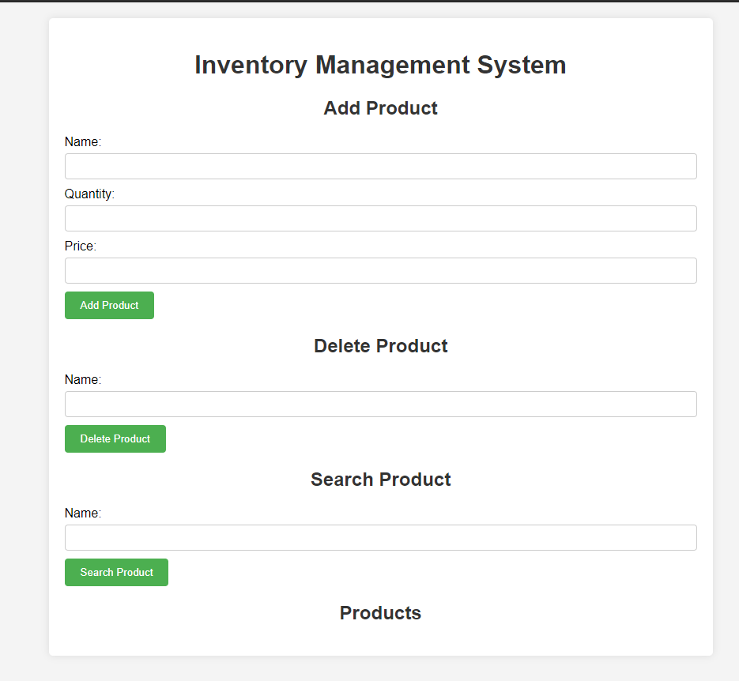

# Simple Inventory Management System

This is a simple inventory management system implemented in PHP.

## How to Run

1. **Clone the Repository:** Clone this repository to your local machine using the following command:

`git clone https://github.com/soymegh/SimpleInventoryChallenge.git`

2. **Navigate to the Directory:** Change your current directory to the project directory:

`cd SimpleInventoryChallenge`

3. **Start a Local Server:** You can use any local server environment like XAMPP, WAMP, Laragon or MAMP. Place the project folder in the appropriate directory of your local server environment.

4. **Start the Server:** Start your local server environment.

5. **Access the Application:** Once the server is running, open your web browser and navigate to the following URL:

`http://localhost/SimpleInventoryChallenge/`

## File Structure

Inside the repository, you'll find the following files:
- `functions.php`: Contains functions for file operations.
- `index.php`: Main file for the inventory management system.
- `inventory.php`: Class definition for inventory management.

## Screenshots or Video

    <a href="https://www.loom.com/share/80599191fa0f49b1b2962c3c3b5832a1">
      
Inventory Management System - 12 April 2024 - Watch Video

    </a>
    
  

